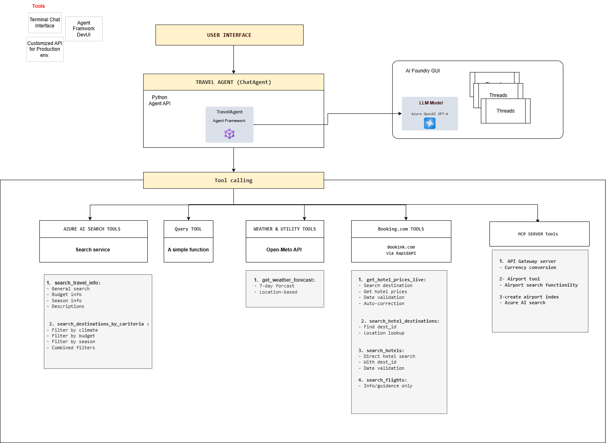

# Travel Agent - Implementation Guide

---

## Architecture Overview

The Travel Agent follows a layered architecture: user interfaces connect to a central AI agent, which calls tools backed by external services.



> Editable version: [travelagent_v3.drawio](diagrams/travelagent_v3.drawio) (open with [draw.io](https://app.diagrams.net))

---

## Components

### 1. User Interfaces

**Terminal Chat** - Run `chat_agent.py` directly for a command-line conversation.

**DevUI** - A local web chat UI for testing, built with `agent_framework_devui`. Runs on port 8090.

```python
from agent_framework_devui import serve
serve(entities=[agent], port=8090)
```

**REST API** - A FastAPI backend at `src/TravelAgent/api/main.py` for programmatic access.

**AI Foundry GUI** - Azure's cloud portal. Manage deployments, test agents in the playground, monitor usage, and browse conversation threads.

---

### 2. Travel Agent (ChatAgent)

The central agent that receives user messages, picks the right tools, runs them, and returns a formatted answer.

```python
agent = agent_client.create_agent(
    name="travelAgent",
    instructions="You are a travel agent with access to multiple data sources...",
    tools=[
        search_travel_info,
        search_destinations_by_criteria,
        get_hotel_prices_live,
        search_hotel_destinations,
        search_hotels,
        search_flights,
        get_weather_forecast,
        get_random_destination,
        get_hotel_prices,
        get_flight_prices,
        get_tourist_volume,
        get_events_calendar,
        MCPStdioTool(name="API Gateway MCP", command="python", args=[...]),
    ],
)
```

Key parts:
- **AzureAIAgentClient** connects to Azure OpenAI (GPT-4).
- **Instructions** define agent behavior and rules.
- **Tools** are Python functions the agent can call.
- **MCPStdioTool** bridges to an external MCP server for currency, airports, visa, and weather APIs.

---

### 3. Threads

A **thread** is a conversation session. It stores every message and tool call so the agent can handle follow-ups.

```python
thread = agent.get_new_thread(message_store=message_store)
response = await agent.run(user_input, thread=thread)
```

Example:
```
User: "Find hotels in Dubai"
       -> Thread stores the query, tool calls, and results.

User: "What about the weather there?"
       -> Thread knows "there" = Dubai from the previous turn.
```

Threads are also visible in AI Foundry GUI under the Threads section.

---

### 4. Tool Calling

Tools are Python functions decorated with `@ai_function`. The agent reads each tool's name, description, and parameters, then decides which one to call based on the user's question.

```python
from agent_framework import ai_function

@ai_function(
    name="search_travel_info",
    description="Search indexed travel database for destination information"
)
def search_travel_info(query: str, top_results: int = 5) -> str:
    # implementation
    return formatted_results
```

**How a tool call works:**

1. User asks a question.
2. The LLM reads the question and the list of available tools.
3. It picks a tool and fills in the parameters.
4. The agent runs the function.
5. The result goes back to the LLM, which formats the final answer.

---

### 5. Tool Categories

**A. Azure AI Search** (indexed data, 600+ destinations)

| Tool | Purpose |
|------|---------|
| `search_travel_info()` | General text search across destinations |
| `search_destinations_by_criteria()` | Filter by climate, budget, or season |

**B. Booking.com API** (live data via RapidAPI)

| Tool | Purpose |
|------|---------|
| `get_hotel_prices_live()` | Look up hotel prices for a city and dates |
| `search_hotel_destinations()` | Find a Booking.com destination ID |
| `search_hotels()` | Detailed hotel search with dest_id |
| `search_flights()` | Flight info (limited) |

**C. Weather and Utility** (Open-Meteo API + simple functions)

| Tool | Purpose |
|------|---------|
| `get_weather_forecast()` | 7-day forecast from Open-Meteo |
| `get_random_destination()` | Pick a random city from a hardcoded list |
| `get_hotel_prices()` | Mock hotel prices (fallback) |
| `get_flight_prices()` | Mock flight prices |
| `get_tourist_volume()` | Mock tourist volume |
| `get_events_calendar()` | Mock event calendar |

**D. MCP Server** (external APIs via Model Context Protocol)

| Tool | Purpose |
|------|---------|
| `convert_currency` | Real-time exchange rates |
| `search_airports` | Airport lookup by city or country (Azure AI Search) |
| `check_visa_requirements` | Visa info between countries |
| `estimate_flight_time` | Flight duration estimate |
| `get_weather` | Current weather via wttr.in |

The MCP server runs as a subprocess (`api_gateway_server.py`) and communicates with the agent over stdio.

---

### 6. Azure AI Search

The `travel-index` stores 600+ destinations with fields like title, content, location, climate, budget level, and best season.

```python
from azure.search.documents import SearchClient

search_client = SearchClient(
    endpoint=search_endpoint,
    index_name="travel-index",
    credential=credential
)

results = search_client.search(
    search_text="Bali",
    filter="climate eq 'tropical'",
    top=5
)
```

There is also an `airports-index` used by the MCP airport tool, created via `create_airports_index.py`.

---

### 7. Booking.com API

Uses the Booking.com API on RapidAPI. A single API key gives access to hotel and flight endpoints.

```python
RAPIDAPI_KEY = os.getenv("RAPIDAPI_KEY")
RAPIDAPI_HOST = "booking-com.p.rapidapi.com"

headers = {
    "x-rapidapi-key": RAPIDAPI_KEY,
    "x-rapidapi-host": RAPIDAPI_HOST
}
```

Endpoints used:
- `/v1/hotels/locations` - Find destination IDs
- `/v1/hotels/search` - Get hotel listings with prices

The `get_hotel_prices_live()` function chains these two calls: first it finds the destination ID, then searches for hotels.

---

## End-to-End Example

**User asks:** "Find hotels in Paris for next week"

1. Agent receives the message in the current thread.
2. LLM identifies this needs `get_hotel_prices_live()` and calculates dates.
3. `get_hotel_prices_live("Paris", checkin, checkout)` runs:
   - Calls `search_hotel_destinations("Paris")` to get `dest_id`.
   - Calls `search_hotels(dest_id, checkin, checkout, adults=2)` to get hotel listings.
4. The tool returns a formatted list of hotels with prices and ratings.
5. The agent presents the results to the user.
6. The thread saves the conversation for follow-up questions.

---

## Example Queries

| Question | Tool Used |
|----------|-----------|
| "Tell me about Bali" | `search_travel_info` |
| "Find tropical destinations under budget" | `search_destinations_by_criteria` |
| "Hotels in Dubai" | `get_hotel_prices_live` |
| "What's the weather in Paris?" | `get_weather_forecast` |
| "Convert 500 USD to EUR" | MCP `convert_currency` |
| "What airports are in London?" | MCP `search_airports` |
| "Do I need a visa from UAE to Japan?" | MCP `check_visa_requirements` |

---

## References

- [Azure AI Agent Service](https://learn.microsoft.com/en-us/azure/ai-services/agents/) - Agent hosting platform
- [Azure AI Agent Framework (Python)](https://github.com/microsoft/agents) - The `agent-framework` and `agent-framework-azure` packages
- [Azure OpenAI Service](https://learn.microsoft.com/en-us/azure/ai-services/openai/) - GPT-4 model deployment
- [Azure AI Search](https://learn.microsoft.com/en-us/azure/search/) - Search service for travel and airport indexes
- [Model Context Protocol (MCP)](https://modelcontextprotocol.io/) - Protocol for the API gateway server (stdio transport)
- [Booking.com API on RapidAPI](https://rapidapi.com/tipsters/api/booking-com) - Hotel and flight data
- [Open-Meteo API](https://open-meteo.com/) - Free weather forecast API
- [FastAPI](https://fastapi.tiangolo.com/) - REST API backend framework
- [Azure AI Evaluation SDK](https://learn.microsoft.com/en-us/azure/ai-studio/how-to/develop/evaluate-sdk) - LLM-as-judge evaluation
